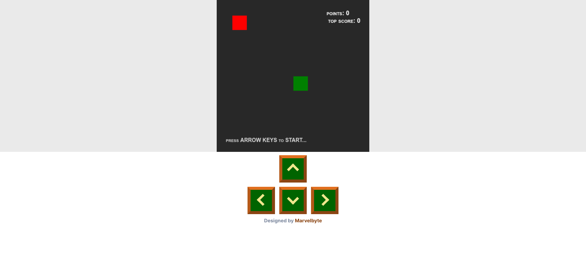

# Snake Game

This repository contains the source code for a Snake Game, which you can integrate into your portfolio website or any other web project. The game is built using HTML, CSS, and JavaScript.



## Demo

You can play the game online by visiting the following link: [Snake Game Demo](https://marvel-snake.vercel.app/)

## Features

- Classic Snake Game: Control the snake to eat fruits and grow longer.
- Responsive Design: The game adapts to different screen sizes for an optimal playing experience.
- Keyboard Controls: Use arrow keys to navigate the snake's movement.
- Score Tracking: Keep track of your points and the top score achieved.

## Installation

1. Clone the repository to your local machine using the following command:

```bash
git clone https://github.com/meetmarvelous/snake_game.git
```

2. Open the `index.html` file in your web browser.

## Usage

You can integrate this Snake Game into your portfolio website or any web project. Follow these steps to include the game in your HTML file:

1. Copy the contents of `index.html`, `style.css`, and `game.js` files into your respective HTML, CSS, and JavaScript files.

2. Ensure that you have the necessary HTML structure and CSS classes to render the game properly.

3. Customize the game's appearance by modifying the CSS in the `style.css` file.

4. Customize the game settings, such as keyboard controls and tail behavior, by calling the appropriate setup functions in the `game.js` file.

5. Start the game by calling the `Snake.start()` function in your JavaScript file or inline script tag.

## Contributing

Contributions are welcome! If you have any suggestions, bug fixes, or new features, please open an issue or submit a pull request.

## License

This project is licensed under the [MIT License](LICENSE).

---
